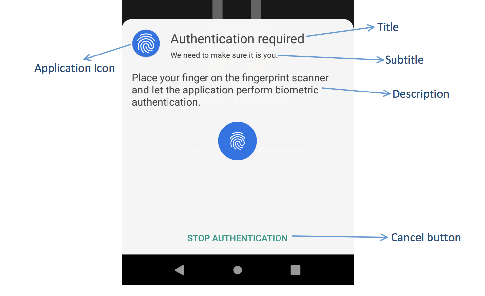

# FingerprintDialogCompat

[](https://travis-ci.org/kevalpatel2106/FingerprintDialogCompat) [](https://android-arsenal.com/api?level=14)  <a href="https://www.paypal.me/kevalpatel2106"> </a> [](http://kevalpatel2106.com/FingerprintDialogCompat/)

#### FingerprintDialog from Android 28 (P) back ported to Android 23 (M).

## Why do we need this library⁉️
- Fingerprint is currently the most secure and most user friendly way of authenticating the user in Android. 
- Android provides different APIs to deal with the fingerprint authentication. These APIs changed overtime. 
    - Android versions below API 23 did not support fingerprint hardware at all.
    - Android versions between API 23 and API 27, uses [`FingerprintManager`](https://developer.android.com/reference/android/hardware/fingerprint/FingerprintManager.html) for fingerprint authentication. Developer has to manually authenticate by implementing bunch of APIs.
    - Android version above API 28, uses [`FingerprintDialog`](https://developer.android.com/reference/android/hardware/fingerprint/FingerprintDialog.html) for fingerprint authentication.
- Due to the Android fragmentation developer has to implement all those APIs based on the android version.😔 It makes managing fingerprint authentication very hard.
- This library aims to simplify fingerprint authentication by providing backport of the `FingerprintDialog` from Android P and provides single public APIs for the authentication all the way to API 14. So as a developer you don't have to deal with the complexity of dealing with different APIs.✌️

## Features:
- Extremely lightweight 🏋.
- Backport of [`FingerprintDialog`](https://developer.android.com/reference/android/hardware/fingerprint/FingerprintDialog.html) from Android P, provides same fingerprint authentication on all Android versions.
- Easy to integrate. All you have to do is implement the builder and you are done. The library will take care of authentication based on the device's android version.
- Classifies different error codes provided by the Android framework and wraps them into different error callbacks for easy error handling.

## How to use this library?
- ### Gradle dependency: 
    - Add below dependency into your build.gradle file.
        ```groovy
        implementation 'com.kevalpatel2106:fingerprint-dialog-compat:1.0'
        ```
    - For other build systems see [Import.md](/.github/IMPORT.md).

- ### Prepare the builder.
    - Create the `FingerprintDialogBuilder` and provide the title, subtitle and the description. Application should explain why they need to access user's fingerprint.  
    - 
    
    #### Java:
    ```java
    final FingerprintDialogBuilder dialogBuilder = new FingerprintDialogBuilder(Activity.this)
        .setTitle(/* Title of the fingerprint dialog */)
        .setSubtitle(/* Subtitle of the fingerprint dialog */)
        .setDescription(/* Description of the fingerprint dialog */)
        .setNegativeButton(/* Negative button of the fingerprint dialog */);
    ```
    
    #### Kotlin:
    ```kotlin
    val dialogBuilder = FingerprintDialogBuilder(this)
        .set  Title(/* Title of the fingerprint dialog */)
        .setSubtitle(/* Subtitle of the fingerprint dialog */)
        .setDescription(/* Description of the fingerprint dialog */)
        .setNegativeButton(/* Negative button of the fingerprint dialog */)
    ```

- ### Implement callbacks and show the dialog.
    - Implement the `AuthenticationCallback` to get callbacks for error or success from the fingerprint authentication dialog.
    
    #### Java:
    ```java
    final AuthenticationCallback callback = new AuthenticationCallback() {
            @Override
            public void fingerprintAuthenticationNotSupported() {
                // Device doesn't support fingerprint authentication. May be device doesn't have fingerprint hardware or device is running on Android below Marshmallow.
                // Switch to alternate authentication method.
            }
    
            @Override
            public void hasNoFingerprintEnrolled() {
                // User has no fingerprint enrolled.
                // Application should redirect the user to the lock screen settings.
                // FingerprintUtils.openSecuritySettings(this)
            }
    
            @Override
            public void onAuthenticationError(final int errorCode, @Nullable final CharSequence errString) {
                // Unrecoverable error. Cannot use fingerprint scanner. Library will stop scanning for the fingerprint after this callback.
                // Switch to alternate authentication method.
            }
    
            @Override
            public void onAuthenticationHelp(final int helpCode, @Nullable final CharSequence helpString) {
                // Authentication process has some warning. such as "Sensor dirty, please clean it."
                // Handle it if you want. Library will continue scanning for the fingerprint after this callback.
            }
    
            @Override
            public void authenticationCanceledByUser() {
                // User canceled the authentication by tapping on the cancel button (which is at the bottom of the dialog).
            }
    
            @Override
            public void onAuthenticationSucceeded() {
                // Authentication success
                // Your user is now authenticated.
            }
    
            @Override
            public void onAuthenticationFailed() {
                // Authentication failed.
                // Library will continue scanning the fingerprint after this callback.
            }
        };
    ```
    
    #### Kotlin:
    ```kotlin
    val callback = object : AuthenticationCallback {
    
        override fun fingerprintAuthenticationNotSupported() {
            // Device doesn't support fingerprint authentication. May be device doesn't have fingerprint hardware or device is running on Android below Marshmallow.
            // Switch to alternate authentication method.
        }

        override fun hasNoFingerprintEnrolled() {
            // User has no fingerprint enrolled.
            // Application should redirect the user to the lock screen settings.
            // FingerprintUtils.openSecuritySettings(this@SecureActivity)
        }

        override fun onAuthenticationError(errorCode: Int, errString: CharSequence?) {    
            // Unrecoverable error. Cannot use fingerprint scanner. Library will stop scanning for the fingerprint after this callback.
            // Switch to alternate authentication method.
        }

        override fun onAuthenticationHelp(helpCode: Int, helpString: CharSequence?) {
            // Authentication process has some warning. such as "Sensor dirty, please clean it."
            // Handle it if you want. Library will continue scanning for the fingerprint after this callback.
        }

        override fun authenticationCanceledByUser() {
            // User canceled the authentication by tapping on the cancel button (which is at the bottom of the dialog).
        }

        override fun onAuthenticationSucceeded() {
            // Authentication success
            // Your user is now authenticated.
        }

        override fun onAuthenticationFailed() {
            // Authentication failed.
            // Library will continue scanning the fingerprint after this callback.
        }
    }
    ```
    
    - Show the dialog and start fingerprint authentication.
    
    #### Java: 
    ```java
    dialogBuilder.show(getSupportFragmentanager(), callback);
    ```
    
    #### Kotlin:
    ```kotlin
    dialogBuilder.show(supportFragmentManager, callback)
    ```

## Screenshots:

|Authentication success|Authentication fail|
|:---:|:---:|
|||


## What to try this out?
- You can download the sample apk from [here](https://github.com/kevalpatel2106/FingerprintDialogCompat/releases) and play with it.


## Want to contribute?
Every small or large contribution to this project is appreciated. Make sure you read the [contribution guide](/.github/CONTRIBUTING.md) before generating the pull request.

## Questions?🤔
Hit me on twitter [](https://twitter.com/kevalpatel2106)

## License
Copyright 2018 Keval Patel

Licensed under the Apache License, Version 2.0 (the "License"); you may not use this file except in compliance with the License. You may obtain a copy of the License at

http://www.apache.org/licenses/LICENSE-2.0

Unless required by applicable law or agreed to in writing, software distributed under the License is distributed on an "AS IS" BASIS, WITHOUT WARRANTIES OR CONDITIONS OF ANY KIND, either express or implied. See the License for the specific language governing permissions and limitations under the License.

<div align="center">

</div>